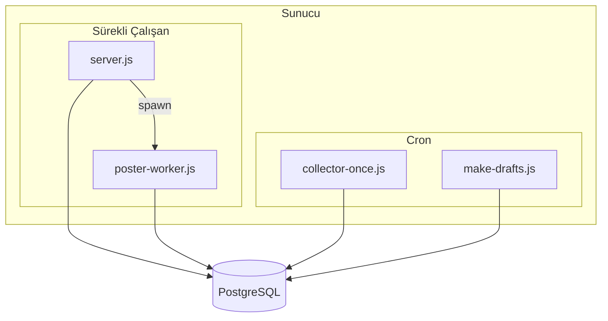

# XAuto – Sunucuya Deploy Rehberi

## Mimari



`server.js` poster-worker'ı spawn eder; tek process yeterli.

## Gereksinimler

- **Node.js 18+**
- **PostgreSQL** (Neon, Supabase, Railway vb.)
- **pm2** (process yönetimi)
- **Sunucu** (VPS, DigitalOcean, Hetzner, AWS EC2 vb.)

## Kurulum Adımları

### 1. Projeyi Sunucuya Al

```bash
git clone <repo-url> xauto
cd xauto
```

### 2. Bağımlılıkları Yükle

```bash
npm install
```

### 3. Ortam Değişkenleri

```bash
cp .env.example .env
# .env dosyasını düzenleyip gerçek değerleri girin
```

Zorunlu: `DATABASE_URL`, `X_USER_BEARER`  
Video için: `X_CONSUMER_KEY`, `X_CONSUMER_SECRET`, `X_ACCESS_TOKEN`, `X_ACCESS_SECRET`  
Gerçek post için: `WORKER_DRY_RUN=false`

### 4. Veritabanı

```bash
node db-init.js
```

Mevcut DB'ye yeni kolonlar eklemek için:

```bash
node db-migrate.js
```

### 5. pm2 ile Başlat

```bash
npm install -g pm2
pm2 start ecosystem.config.cjs
pm2 save
pm2 startup   # Sunucu yeniden başladığında otomatik başlatma
```

### 6. Cron (Opsiyonel)

Collector ve make-drafts'ı periyodik çalıştırmak için:

```cron
# Her 30 dakikada collector, ardından make-drafts
*/30 * * * * cd /path/to/xauto && node collector-once.js && node make-drafts.js
```

`/path/to/xauto` yerine proje dizininizi yazın.

Alternatif: UI'daki "Tweet Çek" ve "Draft Üret" butonlarını kullanabilirsiniz.

### 7. Reverse Proxy (HTTPS)

Nginx örneği:

```nginx
location / {
  proxy_pass http://127.0.0.1:3000;
  proxy_http_version 1.1;
  proxy_set_header Host $host;
  proxy_set_header X-Real-IP $remote_addr;
}
```

Caddy ile:

```
reverse_proxy localhost:3000
```

## Kontrol Listesi

- [ ] `WORKER_DRY_RUN=false` (.env)
- [ ] `DATABASE_URL` geçerli
- [ ] X API credentials tanımlı
- [ ] Health check: `curl http://localhost:3000/health`
- [ ] pm2 log: `pm2 logs xauto`

## Yararlı Komutlar

```bash
pm2 status
pm2 logs xauto
pm2 restart xauto
pm2 stop xauto
```
